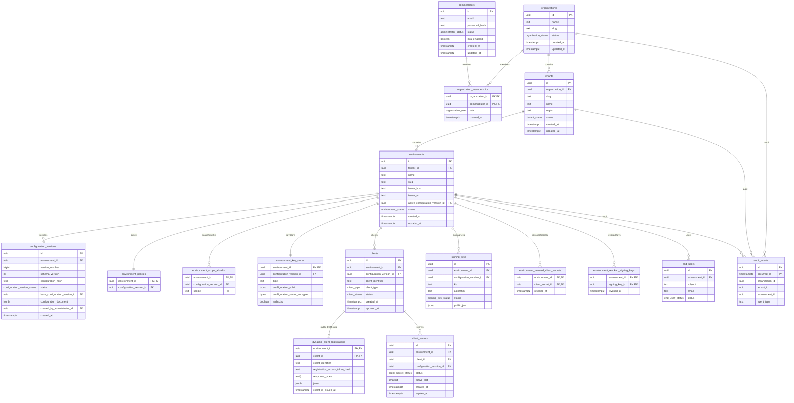

# Management Plane Database Schema

Last updated: 2026-07-08

Status: current implementation baseline

Owner: Product / Engineering

Audience: implementers, reviewers

This document describes a Phase 1 control-plane schema that matches:

- `docs/specs/management-plane/README.md` (resource model, invariants, endpoint skeleton)
- `crates/server/src/openapi/management.rs` + `crates/server/src/openapi/types.rs` (OpenAPI stubs)

The authoritative DDL lives in:

- `db/schema.sql` (desired schema state)
- `db/migrations/` (Atlas-managed versioned migrations)

## Design principles

- **Org/Tenant/Environment** is the management hierarchy.
- **Environment is the OIDC security boundary** (owns issuer, keys, clients, policies).
- **Configuration documents are immutable**: a document change creates a new row in
  `configuration_versions`, and `environments.active_configuration_version_id` selects the active
  document.
- **Effective membership**: activation transfers current live clients/profiles/connections to
  the selected version while preserving stable IDs and payloads. Runtime-key/client-secret version
  IDs retain provenance; their readers select by environment and lifecycle. The document is not a
  complete snapshot of these tables. See the [activation contract](configuration.md#current-persistence-and-activation-contract).
- **Activation safety** preserves credential lifecycle and expiry. Historical credential restoration
  is not implemented; legacy revocation-ledger tables alone do not establish a restoration guarantee.
- **Audit events** are append-only at the API level and are stored as a partitioned table for
  time-range queries. This table is intended for control-plane audit and selected security events,
  not as a full-fidelity sink for high-frequency data-plane access logs (ship those to an
  observability pipeline and/or SIEM instead).

## Table overview (Phase 1)

### Identity & RBAC (control plane)

- `administrators`: local admin principals (Phase 1 local login).
- `organizations`: top-level account boundary.
- `organization_memberships`: admin membership and role within an Organization.

### Hierarchy

- `tenants`: operational unit under an Organization; participates in issuer naming.
- `environments`: OIDC boundary (issuer host, active configuration pointer).

### Configuration documents

- `configuration_versions`: immutable configuration documents per Environment.

### Document state, effective membership and credentials

- Document state: `environment_policies`, `environment_scope_allowlist`,
  `environment_key_stores`.
- Current-version memberships: `clients`, `oauth_profiles`, `connections`.
- Independently managed credentials: `client_secrets`, `runtime_keys`. Version IDs
  on these rows are provenance rather than active-version membership.
- Legacy revocation records: `environment_revoked_client_secrets` and
  `environment_revoked_signing_keys`.

### Users (Phase 1 minimal)

- `end_users`: environment-scoped user subjects for minimal admin actions.

### Audit

- `audit_events` (partitioned by `occurred_at`)

## ERD (Mermaid)

The diagram below is a historical, incomplete design overview. In particular,
`signing_keys` represents an earlier key model; the current schema uses
`runtime_keys` with per-usage lifecycle slots. `db/schema.sql` and the versioned
migrations define the actual table shape.

> Note: The ERD lists primary key columns only. Additional metadata columns are described in the
> sections below.

## Configuration document storage (`configuration_versions`)

- `schema_version` MUST be `1` for Phase 1. Unknown schema versions MUST be rejected by both the
  management plane and the data plane.
- `configuration_hash` stores the canonical SHA-256 of the serialised JSON snapshot. Serialisation
  MUST sort object keys and use UTF-8 encoding so hashes are stable across runtimes.
- `configuration_document` holds the JSON snapshot described in
  `docs/specs/management-plane/configuration.md#snapshot-schema-schemaversion--1-phase-1-normative`. The
  column is immutable after insert.
- `version_number` MUST increase monotonically per Environment. `base_configuration_version_id`
  records the parent snapshot to support optimistic concurrency checks.

Recommended indexes:

- Unique `(environment_id, version_number)`.
- `(environment_id, created_at)` for timeline/history queries.
- Partial `(environment_id)` WHERE `status = 'active'` to accelerate active snapshot lookups.

## Projection tables and constraints

- `clients` MUST enforce uniqueness on `(environment_id, client_identifier)` and SHOULD also provide
  an index on `(environment_id, status)` for administrative queries.
- `dynamic_client_registrations` stores public DCR/RFC 7592 state that does not belong in the
  normalized management client row. It MUST store only a SHA-256 hash of
  `registration_access_token`; generated client secrets remain in `client_secrets` as argon2id
  hashes.
- `client_secrets` MUST enforce the maximum number of concurrently active secrets via a partial
  unique index on `(client_id, active_slot)` WHERE `status = 'active'`. Operators MAY permit 3 slots
  but MUST maintain the same constraint for each slot.
- `runtime_keys` constrains ACTIVE and NEXT slots by environment and usage; key lifecycle remains
  independent of document activation.
- Document state, selected memberships and the active pointer MUST be committed in one transaction.
  Activation MUST NOT transfer unrelated historical rows or rewrite credential provenance.

## Revocation ledgers

The schema retains `environment_revoked_client_secrets` and
`environment_revoked_signing_keys`. Their presence does not prove complete
historical snapshot restoration or universal ledger consultation.

Current activation does not restore credentials from a document. It preserves
credential lifecycle and expiry, which the runtime readers enforce. A compatibility
guard rejects legacy `clientSecrets` references found in the client-secret ledger.
Any future restoration of historical credentials needs explicit coverage for each
credential type and its ledger. See [activation safety](configuration.md#rollback-safety-irreversible-operations).

## Audit events (`audit_events`)

- `event_type` MUST follow the naming scheme defined in
  `docs/specs/management-plane/operations.md#event-type-naming-phase-1`.
- Partitioning by month on `occurred_at` is RECOMMENDED for retention management.
- Recommended indexes:
  - `(organization_id, occurred_at DESC)`
  - `(tenant_id, occurred_at DESC)`
  - `(environment_id, occurred_at DESC)`
  - `(event_type, occurred_at DESC)`
